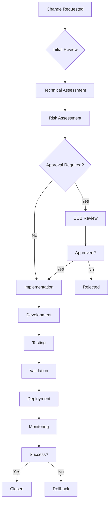

# SMVM Change Control Process

## Overview

This document defines the change control process for the Synthetic Market Validation Module (SMVM). It ensures that all changes to schemas, configurations, and production systems are properly reviewed, approved, tested, and deployed with minimal risk to operations.

## Change Classification

### Change Types
| Type | Description | Approval Required | Testing Required |
|------|-------------|-------------------|------------------|
| **Emergency** | Critical security fix, system down | Executive approval | Post-deployment |
| **Standard** | Schema changes, new features | Change Control Board | Full regression |
| **Minor** | Bug fixes, documentation updates | Lead developer | Unit tests only |
| **Maintenance** | Infrastructure updates, patches | Operations approval | Integration tests |

### Risk Assessment Matrix
| Risk Level | Impact | Likelihood | Approval Level | Testing Scope |
|------------|--------|------------|----------------|---------------|
| **Critical** | System outage, data loss | High | Executive + CCB | Full production simulation |
| **High** | Service degradation, security risk | Medium | CCB approval | Integration + regression |
| **Medium** | Feature impact, performance degradation | Low | Technical lead | Integration tests |
| **Low** | Minimal impact, backward compatible | Very Low | Developer approval | Unit tests |

## Schema Versioning System

### Semantic Versioning for Schemas
```
MAJOR.MINOR.PATCH

MAJOR: Breaking changes (incompatible API changes)
MINOR: New features (backward compatible)
PATCH: Bug fixes (backward compatible)
```

### Schema Version Structure
```json
{
  "$schema": "https://json-schema.org/draft/2020-12/schema",
  "id": "https://smvm.company.com/schemas/personas.output/v1.2.3",
  "title": "SMVM Personas Output Schema",
  "version": "1.2.3",
  "description": "Schema for synthetic persona data output",
  "compatibility": {
    "backward_compatible": true,
    "forward_compatible": false,
    "breaking_changes": []
  },
  "changelog": [
    {
      "version": "1.2.3",
      "date": "2024-12-01",
      "changes": ["Added behavioral_attributes field"],
      "type": "minor"
    },
    {
      "version": "1.2.2",
      "date": "2024-11-15",
      "changes": ["Fixed demographic validation"],
      "type": "patch"
    }
  ]
}
```

### Schema Evolution Rules
1. **Backward Compatibility**: New schema versions must accept old data
2. **Forward Compatibility**: Old consumers must handle new data gracefully
3. **Deprecation Period**: Breaking changes require 6-month deprecation notice
4. **Migration Path**: Provide migration scripts for major version changes

## Change Request Process

### Change Request Template
```yaml
change_request:
  id: "CR-2024-001"
  title: "Add behavioral attributes to personas schema"
  type: "standard"
  requester: "jane.smith@company.com"
  date_requested: "2024-12-01"
  priority: "medium"

  description:
    problem: "Current personas lack behavioral data for better market simulation"
    solution: "Add behavioral_attributes object to personas.output.json"
    impact: "New field will provide richer persona data"

  technical_details:
    affected_components: ["personas service", "simulation service"]
    schema_changes: ["contracts/schemas/personas.output.json"]
    migration_required: false
    rollback_plan: "Remove behavioral_attributes field"

  risk_assessment:
    risk_level: "medium"
    business_impact: "Improved simulation accuracy"
    technical_risk: "Low - backward compatible addition"
    security_impact: "None"

  testing_requirements:
    unit_tests: true
    integration_tests: true
    regression_tests: true
    performance_tests: false

  approval_requirements:
    technical_review: true
    security_review: false
    compliance_review: false
    business_approval: false
```

### Change Request Workflow


## Approval Matrix

### Change Control Board (CCB) Composition
- **Chair**: VP of Engineering
- **Technical Lead**: Principal Engineer
- **Security Representative**: Security Team Lead
- **Compliance Officer**: Compliance Team Lead
- **Business Representative**: Product Manager
- **Operations Representative**: DevOps Lead

### Approval Thresholds
| Change Type | Risk Level | Approvals Required |
|-------------|------------|-------------------|
| **Schema Changes** | Critical | Executive + CCB |
| **Schema Changes** | High | CCB (unanimous) |
| **Schema Changes** | Medium | CCB (majority) |
| **Schema Changes** | Low | Technical lead |
| **Infrastructure** | Critical | Executive + CCB |
| **Infrastructure** | High | CCB + Operations |
| **Infrastructure** | Medium | Operations lead |
| **Code Changes** | Critical | CCB + Security |
| **Code Changes** | High | Technical lead + Security |
| **Code Changes** | Medium | Technical lead |
| **Documentation** | Any | Developer approval |

## Testing & Validation

### Testing Requirements by Change Type
| Change Type | Unit Tests | Integration Tests | Regression Tests | Performance Tests | Security Tests |
|-------------|------------|-------------------|------------------|-------------------|----------------|
| **Schema Addition** | ✅ | ✅ | ✅ | ❌ | ✅ |
| **Schema Modification** | ✅ | ✅ | ✅ | ✅ | ✅ |
| **Schema Removal** | ✅ | ✅ | ✅ | ✅ | ✅ |
| **Service Changes** | ✅ | ✅ | ✅ | ✅ | ✅ |
| **Infrastructure** | ✅ | ✅ | ✅ | ✅ | ❌ |
| **Documentation** | ❌ | ❌ | ❌ | ❌ | ❌ |

### Validation Checklist
- [ ] **Functional Testing**: All new functionality works as expected
- [ ] **Regression Testing**: No existing functionality broken
- [ ] **Performance Testing**: No performance degradation
- [ ] **Security Testing**: No security vulnerabilities introduced
- [ ] **Compatibility Testing**: Works with all supported environments
- [ ] **Documentation**: All changes properly documented

## Deployment Process

### Deployment Stages
1. **Development**: Local development and unit testing
2. **Integration**: Merge to integration branch, integration testing
3. **Staging**: Deploy to staging environment, full testing suite
4. **Production**: Deploy to production with monitoring and rollback plan

### Deployment Validation
```python
def validate_deployment(change_request: dict, deployment_result: dict) -> dict:
    """Validate deployment success and system health"""

    validation = {
        "deployment_id": deployment_result["deployment_id"],
        "validation_timestamp": datetime.utcnow().isoformat() + "Z",
        "checks_performed": [],
        "issues_found": [],
        "overall_status": "unknown"
    }

    # Check service health
    health_check = check_service_health()
    validation["checks_performed"].append("service_health")
    if not health_check["healthy"]:
        validation["issues_found"].append({
            "type": "service_health",
            "severity": "critical",
            "details": health_check["issues"]
        })

    # Check schema compatibility
    schema_check = validate_schema_compatibility(change_request)
    validation["checks_performed"].append("schema_compatibility")
    if not schema_check["compatible"]:
        validation["issues_found"].append({
            "type": "schema_compatibility",
            "severity": "high",
            "details": schema_check["issues"]
        })

    # Check data integrity
    data_check = validate_data_integrity()
    validation["checks_performed"].append("data_integrity")
    if not data_check["intact"]:
        validation["issues_found"].append({
            "type": "data_integrity",
            "severity": "critical",
            "details": data_check["issues"]
        })

    # Determine overall status
    critical_issues = [i for i in validation["issues_found"] if i["severity"] == "critical"]
    if critical_issues:
        validation["overall_status"] = "failed"
    elif validation["issues_found"]:
        validation["overall_status"] = "warning"
    else:
        validation["overall_status"] = "success"

    # Log validation result
    log_change_event("DEPLOYMENT_VALIDATION", change_request["id"], validation)

    return validation
```

## Rollback Procedures

### Automated Rollback
```python
def execute_rollback(change_request: dict, rollback_reason: str) -> dict:
    """Execute automated rollback for failed deployment"""

    rollback_plan = change_request.get("rollback_plan", {})
    if not rollback_plan:
        return {"status": "failed", "reason": "No rollback plan defined"}

    rollback_execution = {
        "change_request_id": change_request["id"],
        "rollback_timestamp": datetime.utcnow().isoformat() + "Z",
        "rollback_reason": rollback_reason,
        "rollback_steps": [],
        "success": True
    }

    try:
        # Stop new version
        stop_result = stop_service_version(change_request["affected_services"])
        rollback_execution["rollback_steps"].append({
            "step": "stop_new_version",
            "result": stop_result,
            "timestamp": datetime.utcnow().isoformat() + "Z"
        })

        # Restore previous version
        restore_result = restore_previous_version(change_request["affected_services"])
        rollback_execution["rollback_steps"].append({
            "step": "restore_previous_version",
            "result": restore_result,
            "timestamp": datetime.utcnow().isoformat() + "Z"
        })

        # Validate rollback
        validation_result = validate_rollback(change_request)
        rollback_execution["rollback_steps"].append({
            "step": "validate_rollback",
            "result": validation_result,
            "timestamp": datetime.utcnow().isoformat() + "Z"
        })

        if not validation_result["valid"]:
            rollback_execution["success"] = False

    except Exception as e:
        rollback_execution["success"] = False
        rollback_execution["error"] = str(e)

    # Log rollback execution
    log_change_event("ROLLBACK_EXECUTION", change_request["id"], rollback_execution)

    return rollback_execution
```

### Rollback Validation
```python
def validate_rollback(change_request: dict) -> dict:
    """Validate that rollback was successful"""

    validation = {
        "valid": True,
        "checks_performed": [],
        "issues_found": []
    }

    # Check service health
    health_check = check_service_health()
    validation["checks_performed"].append("service_health")
    if not health_check["healthy"]:
        validation["valid"] = False
        validation["issues_found"].append({
            "check": "service_health",
            "issue": "Services not healthy after rollback"
        })

    # Check data consistency
    data_check = check_data_consistency(change_request)
    validation["checks_performed"].append("data_consistency")
    if not data_check["consistent"]:
        validation["valid"] = False
        validation["issues_found"].append({
            "check": "data_consistency",
            "issue": "Data inconsistencies detected after rollback"
        })

    # Check schema compatibility
    schema_check = check_schema_compatibility(change_request)
    validation["checks_performed"].append("schema_compatibility")
    if not schema_check["compatible"]:
        validation["valid"] = False
        validation["issues_found"].append({
            "check": "schema_compatibility",
            "issue": "Schema compatibility issues after rollback"
        })

    return validation
```

## Golden Data Management

### Golden Dataset Definition
```python
class GoldenDataset:
    def __init__(self, dataset_id: str, version: str):
        self.dataset_id = dataset_id
        self.version = version
        self.creation_date = datetime.utcnow().isoformat() + "Z"
        self.validation_status = "pending"
        self.golden_records = {}
        self.metadata = {
            "source": "production_data",
            "validation_rules": [],
            "quality_metrics": {},
            "retention_policy": "indefinite"
        }

    def add_golden_record(self, record_id: str, record_data: dict, validation_rules: list):
        """Add a validated record to the golden dataset"""

        golden_record = {
            "record_id": record_id,
            "data": record_data,
            "validation_rules": validation_rules,
            "validation_timestamp": datetime.utcnow().isoformat() + "Z",
            "validated_by": get_current_user(),
            "validation_status": "passed"
        }

        self.golden_records[record_id] = golden_record

        # Update metadata
        self.metadata["quality_metrics"] = self.calculate_quality_metrics()

    def validate_golden_dataset(self) -> dict:
        """Validate the entire golden dataset"""

        validation_results = {
            "dataset_id": self.dataset_id,
            "validation_timestamp": datetime.utcnow().isoformat() + "Z",
            "total_records": len(self.golden_records),
            "validation_checks": [],
            "issues_found": [],
            "overall_status": "unknown"
        }

        # Check data completeness
        completeness_check = self.check_data_completeness()
        validation_results["validation_checks"].append("completeness")
        if not completeness_check["complete"]:
            validation_results["issues_found"].append({
                "check": "completeness",
                "issues": completeness_check["missing_fields"]
            })

        # Check data consistency
        consistency_check = self.check_data_consistency()
        validation_results["validation_checks"].append("consistency")
        if not consistency_check["consistent"]:
            validation_results["issues_found"].append({
                "check": "consistency",
                "issues": consistency_check["inconsistencies"]
            })

        # Check data accuracy
        accuracy_check = self.check_data_accuracy()
        validation_results["validation_checks"].append("accuracy")
        if not accuracy_check["accurate"]:
            validation_results["issues_found"].append({
                "check": "accuracy",
                "issues": accuracy_check["inaccuracies"]
            })

        # Determine overall status
        if validation_results["issues_found"]:
            validation_results["overall_status"] = "failed"
        else:
            validation_results["overall_status"] = "passed"
            self.validation_status = "validated"

        return validation_results

    def calculate_quality_metrics(self) -> dict:
        """Calculate quality metrics for the golden dataset"""

        total_records = len(self.golden_records)

        if total_records == 0:
            return {"completeness": 0, "accuracy": 0, "consistency": 0}

        # Calculate metrics
        metrics = {
            "total_records": total_records,
            "validation_rules_applied": len(set(
                rule for record in self.golden_records.values()
                for rule in record["validation_rules"]
            )),
            "average_validation_score": sum(
                1.0 for record in self.golden_records.values()
                if record["validation_status"] == "passed"
            ) / total_records,
            "data_completeness": self.calculate_completeness_score(),
            "last_updated": datetime.utcnow().isoformat() + "Z"
        }

        return metrics
```

### Golden Data Validation Process
```python
def validate_golden_data_update(proposed_change: dict, golden_dataset: GoldenDataset) -> dict:
    """Validate that a proposed change maintains golden data integrity"""

    validation = {
        "change_id": proposed_change["id"],
        "validation_timestamp": datetime.utcnow().isoformat() + "Z",
        "golden_dataset_version": golden_dataset.version,
        "validation_checks": [],
        "issues_found": [],
        "recommendations": [],
        "approved": False
    }

    # Check impact on golden data
    impact_check = assess_golden_data_impact(proposed_change, golden_dataset)
    validation["validation_checks"].append("impact_assessment")
    if impact_check["high_impact"]:
        validation["issues_found"].append({
            "check": "impact_assessment",
            "severity": "high",
            "details": impact_check["impact_details"]
        })

    # Check backward compatibility
    compatibility_check = check_backward_compatibility(proposed_change, golden_dataset)
    validation["validation_checks"].append("backward_compatibility")
    if not compatibility_check["compatible"]:
        validation["issues_found"].append({
            "check": "backward_compatibility",
            "severity": "critical",
            "details": compatibility_check["incompatibility_details"]
        })

    # Check data quality impact
    quality_check = assess_quality_impact(proposed_change, golden_dataset)
    validation["validation_checks"].append("quality_impact")
    if quality_check["negative_impact"]:
        validation["issues_found"].append({
            "check": "quality_impact",
            "severity": "medium",
            "details": quality_check["quality_changes"]
        })

    # Generate recommendations
    if validation["issues_found"]:
        validation["recommendations"] = generate_change_recommendations(validation["issues_found"])
    else:
        validation["approved"] = True

    # Log validation result
    log_change_event("GOLDEN_DATA_VALIDATION", proposed_change["id"], validation)

    return validation
```

## Audit Trail

### Change Audit Structure
```json
{
  "audit_id": "AUDIT-20241201-143052-abc123",
  "change_request_id": "CR-2024-001",
  "event_type": "SCHEMA_CHANGE",
  "timestamp": "2024-12-01T14:30:52.123456Z",
  "actor": {
    "user_id": "jane.smith@company.com",
    "user_roles": ["developer"],
    "ip_address": "192.168.1.100"
  },
  "change_details": {
    "affected_files": ["contracts/schemas/personas.output.json"],
    "change_type": "addition",
    "change_scope": "field_addition",
    "breaking_change": false
  },
  "approval_details": {
    "approved_by": ["john.doe@company.com", "mary.jane@company.com"],
    "approval_timestamp": "2024-12-01T14:15:00Z",
    "approval_level": "ccb_majority"
  },
  "validation_details": {
    "tests_passed": 45,
    "tests_failed": 0,
    "performance_impact": "none",
    "security_review": "passed"
  },
  "deployment_details": {
    "deployment_timestamp": "2024-12-01T15:00:00Z",
    "deployment_method": "blue_green",
    "rollback_available": true,
    "monitoring_period_days": 7
  },
  "python_version": "3.12.10"
}
```

### Audit Query Interface
```python
def query_change_audit(filters: dict) -> list:
    """Query change audit trail with filters"""

    # Build query based on filters
    query = build_audit_query(filters)

    # Execute query
    audit_events = execute_audit_query(query)

    # Apply access controls
    filtered_events = apply_access_controls(audit_events, get_current_user())

    # Log audit query
    log_audit_event("AUDIT_QUERY", get_current_user(), {
        "filters": filters,
        "results_count": len(filtered_events),
        "query_timestamp": datetime.utcnow().isoformat() + "Z"
    })

    return filtered_events

def build_audit_query(filters: dict) -> dict:
    """Build audit query from filters"""

    query = {
        "collection": "change_audit",
        "filters": {},
        "sort": {"timestamp": -1},
        "limit": filters.get("limit", 100)
    }

    # Apply filters
    if "change_request_id" in filters:
        query["filters"]["change_request_id"] = filters["change_request_id"]

    if "user_id" in filters:
        query["filters"]["actor.user_id"] = filters["user_id"]

    if "date_range" in filters:
        query["filters"]["timestamp"] = {
            "$gte": filters["date_range"]["start"],
            "$lte": filters["date_range"]["end"]
        }

    if "event_type" in filters:
        query["filters"]["event_type"] = filters["event_type"]

    return query
```

## Compliance Reporting

### Change Control Metrics
```python
def generate_change_control_report(time_period: str) -> dict:
    """Generate change control compliance report"""

    report = {
        "report_period": time_period,
        "generated_at": datetime.utcnow().isoformat() + "Z",
        "metrics": {},
        "compliance_status": "unknown",
        "recommendations": []
    }

    # Calculate metrics
    change_metrics = calculate_change_metrics(time_period)
    report["metrics"] = change_metrics

    # Assess compliance
    compliance_assessment = assess_compliance(change_metrics)
    report["compliance_status"] = compliance_assessment["status"]

    # Generate recommendations
    report["recommendations"] = generate_compliance_recommendations(compliance_assessment)

    # Log report generation
    log_compliance_event("CHANGE_CONTROL_REPORT", "system", report)

    return report

def calculate_change_metrics(time_period: str) -> dict:
    """Calculate change control metrics for the period"""

    # Query audit data
    audit_data = query_change_audit({
        "date_range": get_period_date_range(time_period),
        "limit": 10000
    })

    metrics = {
        "total_changes": len(audit_data),
        "changes_by_type": {},
        "changes_by_risk": {},
        "approval_compliance": 0,
        "testing_compliance": 0,
        "rollback_success_rate": 0,
        "average_deployment_time": 0
    }

    # Calculate detailed metrics
    for event in audit_data:
        # Count by type
        change_type = event["change_details"]["change_type"]
        metrics["changes_by_type"][change_type] = metrics["changes_by_type"].get(change_type, 0) + 1

        # Count by risk
        risk_level = assess_change_risk(event)
        metrics["changes_by_risk"][risk_level] = metrics["changes_by_risk"].get(risk_level, 0) + 1

        # Calculate compliance rates
        if event.get("approval_details"):
            metrics["approval_compliance"] += 1

        if event.get("validation_details", {}).get("tests_passed", 0) > 0:
            metrics["testing_compliance"] += 1

    # Convert to percentages
    total_changes = metrics["total_changes"]
    if total_changes > 0:
        metrics["approval_compliance"] = (metrics["approval_compliance"] / total_changes) * 100
        metrics["testing_compliance"] = (metrics["testing_compliance"] / total_changes) * 100

    return metrics
```

---

**Version**: 1.0
**Effective Date**: 2024-12-XX
**Review Date**: 2025-06-XX
**Last Updated**: 2024-12-XX
**Owner**: Change Control Board
**Reviewers**: Engineering Team, Security Team, Compliance Team

*This change control process ensures safe, compliant, and auditable changes to SMVM systems.*
