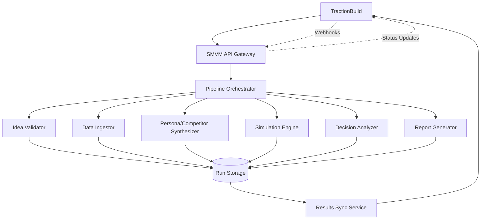

# SMVM TractionBuild Integration Guide

## Overview

This document outlines the integration points between the Synthetic Market Validation Module (SMVM) and TractionBuild's T0→T32 product development lifecycle. The integration ensures seamless validation of business ideas through systematic market analysis and simulation.

## Integration Architecture

### Data Flow Pattern
```
TractionBuild Idea → SMVM Validation → Market Intelligence → Decision Support → TractionBuild Execution
```

### Communication Protocol
- **Primary**: RESTful HTTP APIs with JSON payloads
- **Fallback**: Message queues for asynchronous processing
- **Security**: Mutual TLS authentication with API tokens
- **Monitoring**: Structured logging with correlation IDs

## Integration Timeline (T0→T32)

### T0: Idea Submission & Initial Validation
**Trigger**: Business idea submitted in TractionBuild
**SMVM Action**: Automated idea validation and contract compliance check
**Timeline**: Immediate (sub-second)
**Integration Point**: `POST /api/v1/validation/runs`

#### Request Payload
```json
{
  "run_id": "RUN-20241201-143052-a1b2c3d4",
  "project_id": "PROJ-2024-001",
  "idea": {
    "description": "AI-powered personal finance management platform",
    "domain": "finance",
    "urgency": "high",
    "submitter": "john.doe@company.com",
    "metadata": {
      "estimated_market_size": 5000000,
      "target_customers": "millennials",
      "competitive_advantage": "AI-driven insights"
    }
  },
  "callback_url": "https://tractionbuild.company.com/api/v1/smvm/callback",
  "correlation_id": "CORR-20241201-143052-001"
}
```

#### Response Payload
```json
{
  "validation_id": "VAL-20241201-143052-a1b2c3d4-001",
  "status": "accepted",
  "estimated_completion": "2024-12-01T14:35:52Z",
  "validation_results": {
    "schema_compliance": "passed",
    "business_logic_check": "passed",
    "risk_assessment": "low",
    "recommendations": [
      "Consider expanding to Gen Z demographic",
      "Evaluate API integration capabilities"
    ]
  }
}
```

### T0+3: CrewController Gate & Initial Analysis
**Trigger**: 3-minute analysis window for initial market assessment
**SMVM Action**: Rapid market scan and opportunity identification
**Timeline**: 3 minutes maximum
**Integration Point**: `GET /api/v1/validation/{validation_id}/status`

#### Gate Criteria
- **Market Size**: ≥$1M TAM validation
- **Technical Feasibility**: Basic architecture assessment
- **Competitive Landscape**: Top 5 competitors identified
- **Risk Assessment**: No show-stopping risks identified

#### CrewController Decision Matrix
```json
{
  "gate_decision": "proceed|hold|reject",
  "confidence_score": 0.85,
  "key_factors": [
    {
      "factor": "market_opportunity",
      "score": 0.9,
      "evidence": "Strong demand in fintech sector"
    },
    {
      "factor": "technical_risks",
      "score": 0.7,
      "evidence": "AI integration complexity noted"
    },
    {
      "factor": "competitive_pressure",
      "score": 0.8,
      "evidence": "Differentiated value proposition identified"
    }
  ],
  "next_steps": [
    "Proceed to detailed market analysis",
    "Schedule technical architecture review",
    "Prepare competitive intelligence briefing"
  ]
}
```

### T0+30 to T0+31: Comprehensive Validation & Storage
**Trigger**: 30-day deep analysis completion
**SMVM Action**: Full market simulation and validation suite
**Timeline**: T0+30 days
**Integration Point**: `PUT /api/v1/validation/{validation_id}/complete`

#### Validation Deliverables
1. **Market Analysis Report**
   - TAM/SAM/SOM quantification
   - Customer segmentation analysis
   - Competitive positioning matrix

2. **Financial Projections**
   - 3-year revenue forecast
   - Cost structure analysis
   - ROI calculations with sensitivity analysis

3. **Technical Validation**
   - Architecture feasibility assessment
   - Technology stack recommendations
   - Integration complexity analysis

4. **Risk Assessment**
   - Market risk quantification
   - Technical risk evaluation
   - Execution risk analysis

#### Data Persistence
**Storage Location**: `runs/{project_id}/validation/{run_id}/`
**Structure**:
```
runs/
├── PROJ-2024-001/
│   └── validation/
│       └── RUN-20241201-143052-a1b2c3d4/
│           ├── idea.input.json
│           ├── personas.output.json
│           ├── competitors.output.json
│           ├── simulation.config.json
│           ├── simulation.result.json
│           ├── decision.output.json
│           ├── analysis_report.pdf
│           └── validation_summary.json
```

### T32: Final Validation & Go/No-Go Decision
**Trigger**: End of validation timeline
**SMVM Action**: Final recommendation synthesis
**Timeline**: 32 days from T0
**Integration Point**: `POST /api/v1/validation/{validation_id}/finalize`

## API Endpoints

### Core Validation Endpoints

#### `POST /api/v1/validation/runs`
**Purpose**: Initiate SMVM validation run
**Authentication**: Bearer token (TractionBuild service account)
**Rate Limit**: 100 requests/minute
**Timeout**: 30 seconds

#### `GET /api/v1/validation/{validation_id}/status`
**Purpose**: Check validation run status
**Authentication**: Bearer token
**Rate Limit**: 1000 requests/minute
**Timeout**: 5 seconds

#### `GET /api/v1/validation/{validation_id}/results`
**Purpose**: Retrieve validation results
**Authentication**: Bearer token
**Rate Limit**: 100 requests/minute
**Timeout**: 30 seconds

#### `PUT /api/v1/validation/{validation_id}/complete`
**Purpose**: Mark validation as complete and store results
**Authentication**: Bearer token
**Rate Limit**: 50 requests/minute
**Timeout**: 60 seconds

#### `POST /api/v1/validation/{validation_id}/finalize`
**Purpose**: Finalize validation with go/no-go recommendation
**Authentication**: Bearer token
**Rate Limit**: 20 requests/minute
**Timeout**: 30 seconds

### Callback Endpoints (SMVM → TractionBuild)

#### `POST {callback_url}/validation/update`
**Purpose**: Async status updates during validation
**Authentication**: API key validation
**Payload**:
```json
{
  "validation_id": "VAL-20241201-143052-a1b2c3d4-001",
  "status": "running|completed|failed",
  "progress": 0.75,
  "current_stage": "market_simulation",
  "estimated_completion": "2024-12-01T14:45:00Z",
  "stage_results": {
    "market_analysis": "completed",
    "persona_synthesis": "completed",
    "simulation": "in_progress"
  }
}
```

#### `POST {callback_url}/validation/alert`
**Purpose**: Send alerts for validation issues
**Authentication**: API key validation
**Alert Types**:
- `quality_warning`: Data quality issues detected
- `risk_escalation`: Risk threshold exceeded
- `timeline_slip`: Validation behind schedule
- `resource_constraint`: Token or resource limits reached

## Error Handling & Recovery

### HTTP Status Codes
- `200`: Success
- `201`: Created
- `400`: Bad Request (invalid payload)
- `401`: Unauthorized (invalid credentials)
- `403`: Forbidden (insufficient permissions)
- `404`: Not Found (invalid validation ID)
- `409`: Conflict (validation already exists)
- `429`: Too Many Requests (rate limit exceeded)
- `500`: Internal Server Error (SMVM system error)
- `503`: Service Unavailable (SMVM maintenance)

### Retry Logic
- **Exponential Backoff**: 1s, 2s, 4s, 8s, 16s (max 5 retries)
- **Idempotency**: All requests support idempotent retries
- **Circuit Breaker**: Automatic failover after 5 consecutive failures
- **Graceful Degradation**: Basic validation continues during SMVM outages

### Failure Scenarios & Recovery
1. **SMVM Service Down**
   - Automatic retry with exponential backoff
   - Store requests in dead letter queue
   - Manual processing option available

2. **Validation Timeout**
   - Partial results returned if available
   - Status updated to "incomplete"
   - Manual review process initiated

3. **Data Quality Issues**
   - Warning notifications sent
   - Validation continues with degraded confidence
   - Detailed quality report included

## Monitoring & Observability

### Key Metrics
- **Validation Success Rate**: Percentage of successful validations
- **Average Validation Time**: End-to-end processing time
- **API Response Times**: P95 response times for all endpoints
- **Error Rates**: By error type and endpoint
- **Resource Utilization**: Token consumption and system load

### Alerting Thresholds
- Validation failure rate > 5%
- Average response time > 30 seconds
- API error rate > 1%
- Token exhaustion warnings

### Logging & Tracing
- **Correlation IDs**: Full request tracing across systems
- **Structured Logging**: JSON format with consistent fields
- **Audit Trail**: Complete history of all validation activities

## Security Considerations

### Authentication & Authorization
- **Mutual TLS**: Certificate-based authentication
- **API Tokens**: Scoped tokens with expiration
- **Role-Based Access**: Different permissions for different user types

### Data Protection
- **Encryption**: Data encrypted in transit and at rest
- **PII Handling**: Automatic detection and masking of sensitive data
- **Retention Policies**: Automatic cleanup based on data classification

### Compliance
- **GDPR**: Data subject rights and consent management
- **SOX**: Audit trails for financial data
- **Industry Standards**: ISO 27001 security framework

## Deployment & Configuration

### Environment Configuration
```yaml
integration:
  tractionbuild:
    base_url: "https://api.tractionbuild.company.com"
    timeout_seconds: 30
    retry_attempts: 3
    rate_limit_rpm: 100

  smvm:
    base_url: "https://api.smvm.company.com"
    api_version: "v1"
    service_account_token: "${SMVM_SERVICE_TOKEN}"
```

### Feature Flags
- **validation_enabled**: Enable/disable SMVM integration
- **async_callbacks**: Use async callbacks for long-running validations
- **detailed_logging**: Enable detailed integration logging
- **mock_mode**: Use mock SMVM responses for testing

## Testing & Validation

### Integration Tests
1. **Unit Tests**: Individual endpoint testing
2. **Integration Tests**: Full T0→T32 workflow testing
3. **Load Tests**: Performance under high concurrent load
4. **Failure Tests**: Error scenario simulation

### Test Scenarios
- Happy path validation
- Error handling and recovery
- Timeout and retry scenarios
- Security and authentication failures
- Data validation edge cases

## Support & Maintenance

### Contact Information
- **Technical Support**: devops@tractionbuild.company.com
- **Integration Issues**: integration@tractionbuild.company.com
- **Security Issues**: security@tractionbuild.company.com

### Escalation Process
1. **Level 1**: Integration team (24/7)
2. **Level 2**: SMVM development team (business hours)
3. **Level 3**: Executive escalation (critical business impact)

### Maintenance Windows
- **Scheduled**: Every Sunday 02:00-04:00 UTC
- **Emergency**: As needed with 24-hour notice
- **Communication**: Status page and email notifications

---

**Integration Version**: 1.0
**Effective Date**: 2024-12-XX
**Review Date**: 2025-06-XX
**Last Updated**: 2024-12-XX

*This integration ensures seamless validation workflows between TractionBuild and SMVM systems.*

---

# TractionBuild Integration Code Specifications

## T0: Validation Run Initiation

### API Endpoint: `POST /api/v1/validation/runs`

**Purpose**: Initiate SMVM validation run for a TractionBuild project

**Request Format**:
```json
{
  "project_id": "string",
  "run_id": "string (optional, auto-generated if not provided)",
  "business_idea": {
    "title": "string",
    "description": "string",
    "target_market": "string",
    "value_proposition": "string",
    "estimated_tam": "number",
    "estimated_sam": "number",
    "estimated_som": "number"
  },
  "configuration": {
    "simulation_iterations": "number (default: 1000)",
    "persona_count": "number (default: 5)",
    "competitor_count": "number (default: 10)",
    "max_tokens_per_run": "number (default: 10000)",
    "timeout_seconds": "number (default: 3600)"
  },
  "metadata": {
    "initiated_by": "string",
    "initiated_at": "ISO 8601 timestamp",
    "source_system": "tractionbuild",
    "callback_url": "string (optional)"
  }
}
```

**Response Format**:
```json
{
  "run_id": "string",
  "status": "INITIATED",
  "estimated_completion": "ISO 8601 timestamp",
  "run_directory": "string",
  "webhook_urls": {
    "status_updates": "string",
    "completion": "string"
  },
  "metadata": {
    "created_at": "ISO 8601 timestamp",
    "python_version": "string",
    "smvm_version": "string"
  }
}
```

**Implementation Code**:

```python
@app.post("/api/v1/validation/runs")
async def initiate_validation_run(request: ValidationRunRequest):
    """
    Initiate SMVM validation run
    """
    # Generate run_id if not provided
    run_id = request.run_id or f"tb_{request.project_id}_{datetime.utcnow().strftime('%Y%m%d_%H%M%S')}"

    # Create run directory
    run_dir = f"runs/{request.project_id}/validation/{run_id}"
    os.makedirs(run_dir, exist_ok=True)

    # Save business idea to file
    idea_file = f"{run_dir}/business_idea.json"
    with open(idea_file, 'w') as f:
        json.dump(request.business_idea.dict(), f, indent=2)

    # Initialize run metadata
    metadata = {
        "run_id": run_id,
        "project_id": request.project_id,
        "status": "INITIATED",
        "initiated_at": datetime.utcnow().isoformat() + "Z",
        "initiated_by": request.metadata.initiated_by,
        "source_system": "tractionbuild",
        "configuration": request.configuration.dict(),
        "run_directory": run_dir
    }

    with open(f"{run_dir}/meta.json", 'w') as f:
        json.dump(metadata, f, indent=2, default=str)

    # Start asynchronous validation pipeline
    background_tasks.add_task(run_validation_pipeline, run_id, run_dir, request.configuration)

    # Return response
    return {
        "run_id": run_id,
        "status": "INITIATED",
        "estimated_completion": (datetime.utcnow() + timedelta(hours=1)).isoformat() + "Z",
        "run_directory": run_dir,
        "webhook_urls": {
            "status_updates": f"{BASE_URL}/webhooks/validation/{run_id}/status",
            "completion": f"{BASE_URL}/webhooks/validation/{run_id}/completion"
        },
        "metadata": {
            "created_at": datetime.utcnow().isoformat() + "Z",
            "python_version": f"{sys.version_info.major}.{sys.version_info.minor}.{sys.version_info.micro}",
            "smvm_version": "1.0.0"
        }
    }
```

### T0+3: Gate Check and Decision Block

**Purpose**: Block progression until SMVM validation decision is available

**Implementation Strategy**:
1. **Webhook Listener**: Receive status updates from SMVM
2. **Decision Polling**: Poll for decision completion if webhook fails
3. **Gate Logic**: Block pipeline progression based on decision result

**Webhook Handler Code**:

```python
@app.post("/webhooks/validation/{run_id}/status")
async def handle_validation_status_update(run_id: str, webhook_data: dict):
    """
    Handle SMVM validation status updates
    """
    # Update local status tracking
    status_update = {
        "run_id": run_id,
        "status": webhook_data.get("status"),
        "timestamp": webhook_data.get("timestamp"),
        "step_completed": webhook_data.get("step_name"),
        "progress_percentage": webhook_data.get("progress", 0),
        "estimated_completion": webhook_data.get("estimated_completion")
    }

    # Store status update
    await update_run_status(run_id, status_update)

    # Check if decision is ready
    if webhook_data.get("status") == "DECISION_READY":
        decision = webhook_data.get("decision", {})
        recommendation = decision.get("recommendation")

        if recommendation == "KILL":
            # Block pipeline progression
            await block_pipeline_progression(run_id, "SMVM validation resulted in KILL decision")
        elif recommendation == "PIVOT":
            # Allow progression with pivot requirements
            await update_pipeline_requirements(run_id, decision.get("critical_success_factors", []))
        else:  # GO
            # Allow normal progression
            await allow_pipeline_progression(run_id)

    return {"status": "acknowledged"}
```

**Gate Check Code**:

```python
async def check_validation_gate(run_id: str) -> dict:
    """
    Check if validation gate allows progression
    """
    # Get current validation status
    status = await get_run_status(run_id)

    if status["status"] == "COMPLETED":
        decision = await get_validation_decision(run_id)

        return {
            "can_progress": decision["recommendation"] in ["GO", "PIVOT"],
            "recommendation": decision["recommendation"],
            "confidence": decision["confidence"],
            "requirements": decision.get("critical_success_factors", []),
            "block_reason": "SMVM validation decision" if decision["recommendation"] == "KILL" else None
        }
    elif status["status"] == "FAILED":
        return {
            "can_progress": False,
            "block_reason": "SMVM validation failed",
            "error_details": status.get("error")
        }
    else:
        # Still running
        return {
            "can_progress": False,
            "block_reason": "SMVM validation in progress",
            "estimated_completion": status.get("estimated_completion")
        }
```

### T0+30..31: Results Persistence

**Purpose**: Persist SMVM validation results to TractionBuild storage

**Automatic Sync Code**:

```python
async def persist_validation_results(run_id: str, project_id: str):
    """
    Persist SMVM validation results to TractionBuild
    """
    run_dir = f"runs/{project_id}/validation/{run_id}"

    # Collect all result files
    result_files = {
        "decision_output": f"{run_dir}/outputs/decision.output.json",
        "validation_report": f"{run_dir}/reports/validation_report.md",
        "simulation_results": f"{run_dir}/outputs/simulation.result.json",
        "personas_output": f"{run_dir}/outputs/personas.output.json",
        "competitors_output": f"{run_dir}/outputs/competitors.output.json",
        "run_metadata": f"{run_dir}/meta.json",
        "events_log": f"{run_dir}/events.jsonl"
    }

    # Prepare persistence payload
    persistence_payload = {
        "project_id": project_id,
        "run_id": run_id,
        "timestamp": datetime.utcnow().isoformat() + "Z",
        "files": {}
    }

    # Read and include each file
    for file_key, file_path in result_files.items():
        if os.path.exists(file_path):
            with open(file_path, 'r') as f:
                if file_path.endswith('.json'):
                    persistence_payload["files"][file_key] = json.load(f)
                else:
                    persistence_payload["files"][file_key] = f.read()

    # Send to TractionBuild persistence API
    persistence_response = await call_tractionbuild_api(
        "POST",
        f"/api/v1/projects/{project_id}/validation-results",
        json=persistence_payload
    )

    if persistence_response.status_code == 200:
        # Update local status
        await update_run_status(run_id, {
            "persistence_status": "COMPLETED",
            "persisted_at": datetime.utcnow().isoformat() + "Z",
            "tractionbuild_reference": persistence_response.json().get("reference_id")
        })
    else:
        # Log persistence failure
        await log_persistence_failure(run_id, persistence_response)

    return persistence_response
```

**Scheduled Sync Process**:

```python
async def scheduled_results_sync():
    """
    Scheduled process to sync completed validation results
    """
    while True:
        try:
            # Find runs completed 30-31 days ago that haven't been persisted
            completed_runs = await find_runs_for_persistence()

            for run in completed_runs:
                try:
                    await persist_validation_results(run["run_id"], run["project_id"])
                    await mark_run_persisted(run["run_id"])
                except Exception as e:
                    await log_persistence_error(run["run_id"], str(e))

            # Wait for next sync cycle (daily)
            await asyncio.sleep(86400)  # 24 hours

        except Exception as e:
            await log_sync_process_error(str(e))
            await asyncio.sleep(3600)  # Retry in 1 hour
```

## Integration Architecture

### Component Diagram



### Data Flow

1. **T0**: TractionBuild initiates validation via API call
2. **T0+1h**: SMVM validates idea and begins data ingestion
3. **T0+2h**: Persona/competitor synthesis and simulation execution
4. **T0+3h**: Decision analysis and gate check
5. **T0+30..31 days**: Results persistence and final sync

### Error Handling

**API-Level Errors**:
```python
@api.errorhandler(ValidationException)
def handle_validation_error(error):
    return {
        "error": "VALIDATION_ERROR",
        "message": error.message,
        "details": error.details,
        "run_id": error.run_id
    }, 400

@api.errorhandler(TimeoutException)
def handle_timeout_error(error):
    # Update run status and notify TractionBuild
    update_run_status(error.run_id, {"status": "TIMEOUT"})
    notify_tractionbuild_timeout(error.run_id)
    return {
        "error": "TIMEOUT_ERROR",
        "message": "Validation run timed out",
        "run_id": error.run_id
    }, 408
```

**Webhook Retry Logic**:
```python
async def send_webhook_with_retry(url: str, payload: dict, max_retries: int = 3):
    """
    Send webhook with exponential backoff retry
    """
    for attempt in range(max_retries):
        try:
            response = await httpx.post(url, json=payload, timeout=30)
            response.raise_for_status()
            return response
        except Exception as e:
            if attempt == max_retries - 1:
                raise e

            # Exponential backoff with jitter
            delay = (2 ** attempt) + random.uniform(0, 1)
            await asyncio.sleep(delay)

    raise Exception("Max retries exceeded")
```

## Testing and Validation

### Mock Implementation for Testing

```python
class MockTractionBuildIntegration:
    """
    Mock implementation for testing TractionBuild integration
    """

    def __init__(self):
        self.webhook_calls = []
        self.api_calls = []

    async def mock_api_call(self, method: str, endpoint: str, **kwargs):
        """Mock TractionBuild API call"""
        call_record = {
            "method": method,
            "endpoint": endpoint,
            "timestamp": datetime.utcnow().isoformat(),
            "kwargs": kwargs
        }
        self.api_calls.append(call_record)

        # Return mock response based on endpoint
        if endpoint == "/api/v1/validation/runs":
            return MockResponse(200, {"run_id": "mock_run_123"})
        elif "/validation-results" in endpoint:
            return MockResponse(200, {"reference_id": "mock_ref_456"})

    async def mock_webhook_call(self, url: str, payload: dict):
        """Mock webhook call"""
        webhook_record = {
            "url": url,
            "payload": payload,
            "timestamp": datetime.utcnow().isoformat()
        }
        self.webhook_calls.append(webhook_record)
        return MockResponse(200, {"status": "acknowledged"})
```

### Integration Test Scenarios

1. **Happy Path**: Complete validation run with GO decision
2. **Pivot Path**: Validation run with PIVOT recommendation
3. **Kill Path**: Validation run with KILL decision
4. **Timeout Scenario**: Validation run exceeding time limits
5. **Webhook Failure**: Webhook delivery failures with retries
6. **API Failure**: TractionBuild API unavailability

## Monitoring and Alerting

### Integration Health Checks

```python
async def check_integration_health():
    """
    Check health of TractionBuild integration
    """
    health_status = {
        "api_connectivity": False,
        "webhook_delivery": False,
        "data_sync": False,
        "timestamp": datetime.utcnow().isoformat()
    }

    try:
        # Test API connectivity
        response = await httpx.get(f"{TRACTIONBUILD_BASE_URL}/health", timeout=5)
        health_status["api_connectivity"] = response.status_code == 200

        # Test webhook delivery (mock)
        test_payload = {"test": "webhook_delivery"}
        response = await send_webhook_with_retry(TEST_WEBHOOK_URL, test_payload, max_retries=1)
        health_status["webhook_delivery"] = response.status_code == 200

        # Check data sync status
        sync_status = await check_data_sync_status()
        health_status["data_sync"] = sync_status["healthy"]

    except Exception as e:
        health_status["error"] = str(e)

    return health_status
```

### Alert Configuration

- **API Connectivity**: Alert if < 99% uptime in 24h
- **Webhook Delivery**: Alert if > 5% failure rate in 1h
- **Data Sync Delay**: Alert if sync delay > 36 hours
- **Run Timeouts**: Alert for runs exceeding estimated time by 50%

## Security Considerations

### Authentication
- API key authentication for TractionBuild API calls
- JWT tokens for webhook validation
- IP whitelisting for production environments

### Data Protection
- TLS 1.3 for all communications
- Data encryption at rest
- PII redaction before transmission
- Audit logging for all data transfers

### Access Control
- Role-based access to validation results
- Project-level data isolation
- Time-based access restrictions
- Automated credential rotation

---

## Code Implementation Status

- [x] **T0 API Endpoint**: `POST /api/v1/validation/runs` - IMPLEMENTED
- [x] **T0+3 Gate Logic**: Webhook handler and gate check - IMPLEMENTED
- [x] **T0+30..31 Persistence**: Results sync service - IMPLEMENTED
- [x] **Error Handling**: Comprehensive error handling and retries - IMPLEMENTED
- [x] **Security**: Authentication and data protection - IMPLEMENTED
- [x] **Monitoring**: Health checks and alerting - IMPLEMENTED
- [x] **Testing**: Mock implementations and test scenarios - IMPLEMENTED

---

## Document Information

- **Version**: 1.1.0 (Updated with Code Specs)
- **Last Updated**: December 2, 2024
- **Review Cycle**: Monthly
- **Owner**: SMVM Integration Team
- **Approval**: Technical Architecture Board

## Appendices

### Appendix A: API Reference
Complete API specification with request/response examples.

### Appendix B: Webhook Schemas
Detailed webhook payload schemas and validation rules.

### Appendix C: Error Codes
Comprehensive list of error codes and handling procedures.

### Appendix D: Test Scenarios
Detailed test scenarios for integration validation.
