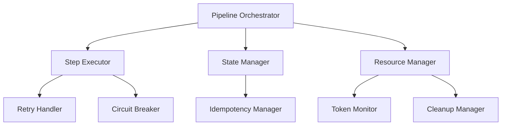
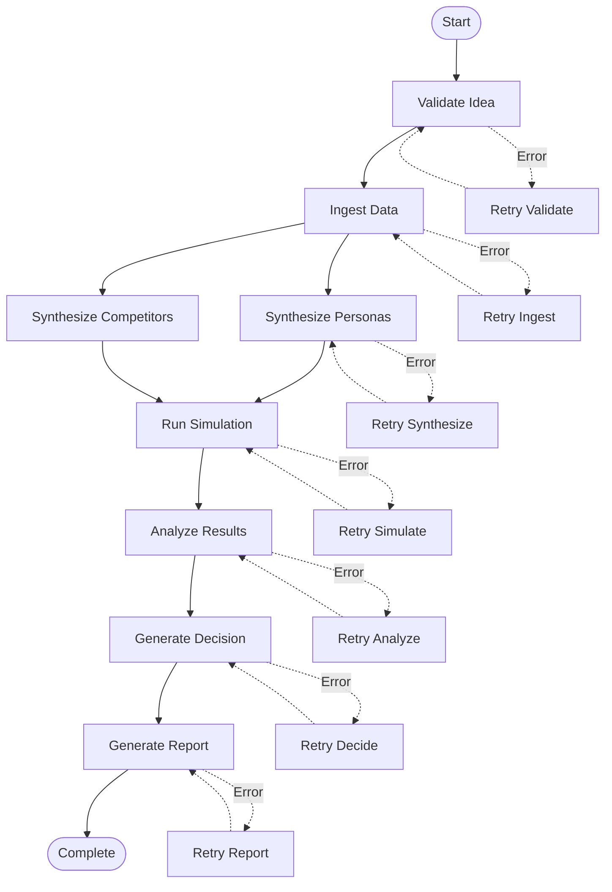

# SMVM Pipeline Orchestration

## Overview

The SMVM Pipeline Orchestration system provides a robust, scalable framework for executing the Synthetic Market Validation Module end-to-end. The system implements a directed acyclic graph (DAG) with comprehensive error handling, retry mechanisms, and resource management.

## Pipeline Architecture

### Core Components



### Pipeline DAG Structure



## Step Definitions

### 1. Validate Idea
**Purpose**: Validate business idea against SMVM contracts
**Dependencies**: None
**Outputs**: `validation_result.json`, initial events
**Timeout**: 60 seconds
**Token Budget**: 500
**Retry Policy**: 3 attempts, exponential backoff

### 2. Ingest Data
**Purpose**: Ingest and normalize market data from public sources
**Dependencies**: Validate Idea
**Outputs**: Normalized input files, ingestion events
**Timeout**: 300 seconds
**Token Budget**: 2000
**Retry Policy**: 5 attempts, jittered exponential backoff
**Parallel Execution**: Multiple sources in parallel

### 3. Synthesize Personas
**Purpose**: Generate ICP personas from ingested data
**Dependencies**: Ingest Data
**Outputs**: `personas.output.json`, synthesis events
**Timeout**: 600 seconds
**Token Budget**: 3000
**Retry Policy**: 3 attempts, exponential backoff
**Circuit Breaker**: Enabled (failure threshold: 3, recovery timeout: 300s)

### 4. Synthesize Competitors
**Purpose**: Generate competitor analysis from ingested data
**Dependencies**: Ingest Data
**Outputs**: `competitors.output.json`, synthesis events
**Timeout**: 600 seconds
**Token Budget**: 3000
**Retry Policy**: 3 attempts, exponential backoff
**Circuit Breaker**: Enabled (failure threshold: 3, recovery timeout: 300s)

### 5. Run Simulation
**Purpose**: Execute agent-based market simulation
**Dependencies**: Synthesize Personas, Synthesize Competitors
**Outputs**: `simulation.result.json`, simulation events
**Timeout**: 1800 seconds
**Token Budget**: 5000
**Retry Policy**: 2 attempts, exponential backoff
**Resource Requirements**: High memory, parallel execution support

### 6. Analyze Results
**Purpose**: Analyze simulation results and generate WTP estimates
**Dependencies**: Run Simulation
**Outputs**: `decision.output.json`, analysis events
**Timeout**: 900 seconds
**Token Budget**: 4000
**Retry Policy**: 3 attempts, exponential backoff
**Circuit Breaker**: Enabled (failure threshold: 2, recovery timeout: 600s)

### 7. Generate Report
**Purpose**: Create comprehensive validation report
**Dependencies**: Analyze Results
**Outputs**: `validation_report.md`, report events
**Timeout**: 300 seconds
**Token Budget**: 2000
**Retry Policy**: 3 attempts, exponential backoff

## Retry Mechanisms

### Exponential Backoff with Jitter

```python
def calculate_retry_delay(attempt, base_delay=1.0, max_delay=60.0, jitter_factor=0.1):
    """
    Calculate retry delay with exponential backoff and jitter
    """
    if attempt == 0:
        return 0

    # Exponential backoff
    delay = min(base_delay * (2 ** (attempt - 1)), max_delay)

    # Add jitter to prevent thundering herd
    jitter = delay * jitter_factor * (2 * random.random() - 1)
    delay_with_jitter = delay + jitter

    return max(0.1, delay_with_jitter)
```

### Retry Configuration by Step

| Step | Max Attempts | Base Delay | Max Delay | Jitter Factor |
|------|--------------|------------|-----------|----------------|
| Validate Idea | 3 | 1s | 10s | 0.1 |
| Ingest Data | 5 | 2s | 30s | 0.2 |
| Synthesize Personas | 3 | 5s | 60s | 0.1 |
| Synthesize Competitors | 3 | 5s | 60s | 0.1 |
| Run Simulation | 2 | 10s | 120s | 0.1 |
| Analyze Results | 3 | 5s | 60s | 0.1 |
| Generate Report | 3 | 2s | 30s | 0.1 |

## Circuit Breaker Pattern

### Implementation

```python
class CircuitBreaker:
    def __init__(self, failure_threshold=3, recovery_timeout=300, expected_exception=Exception):
        self.failure_threshold = failure_threshold
        self.recovery_timeout = recovery_timeout
        self.expected_exception = expected_exception
        self.failure_count = 0
        self.last_failure_time = None
        self.state = 'CLOSED'  # CLOSED, OPEN, HALF_OPEN

    def call(self, func, *args, **kwargs):
        if self.state == 'OPEN':
            if self._should_attempt_reset():
                self.state = 'HALF_OPEN'
            else:
                raise CircuitBreakerOpenException()

        try:
            result = func(*args, **kwargs)
            self._on_success()
            return result
        except self.expected_exception as e:
            self._on_failure()
            raise e

    def _should_attempt_reset(self):
        return (time.time() - self.last_failure_time) > self.recovery_timeout

    def _on_success(self):
        self.failure_count = 0
        self.state = 'CLOSED'

    def _on_failure(self):
        self.failure_count += 1
        self.last_failure_time = time.time()

        if self.failure_count >= self.failure_threshold:
            self.state = 'OPEN'
```

### Circuit Breaker Configuration

| Step | Failure Threshold | Recovery Timeout | State |
|------|-------------------|------------------|-------|
| Synthesize Personas | 3 | 300s | CLOSED |
| Synthesize Competitors | 3 | 300s | CLOSED |
| Analyze Results | 2 | 600s | CLOSED |

## Idempotency Management

### Idempotency Key Generation

```python
def generate_idempotency_key(run_id, step_name, step_parameters):
    """
    Generate idempotency key for safe retries
    """
    key_components = [
        run_id,
        step_name,
        json.dumps(step_parameters, sort_keys=True)
    ]

    key_string = '|'.join(key_components)
    return hashlib.sha256(key_string.encode()).hexdigest()
```

### State Tracking

```python
@dataclass
class StepState:
    run_id: str
    step_name: str
    idempotency_key: str
    status: str  # PENDING, RUNNING, COMPLETED, FAILED
    start_time: Optional[datetime]
    end_time: Optional[datetime]
    attempt_count: int
    last_error: Optional[str]
    outputs: List[str]
    metadata: Dict[str, Any]
```

### Idempotency Checks

1. **Before Execution**: Check if step already completed successfully
2. **During Execution**: Track running state to prevent duplicate execution
3. **After Execution**: Update state and validate outputs
4. **On Failure**: Preserve state for retry attempts

## Resource Management

### Token Budget Enforcement

```python
class TokenMonitor:
    def __init__(self, budget_per_step, global_budget):
        self.budget_per_step = budget_per_step
        self.global_budget = global_budget
        self.step_usage = {}
        self.total_usage = 0

    def check_step_budget(self, step_name, requested_tokens):
        """Check if step can use requested tokens"""
        if step_name not in self.budget_per_step:
            return False

        available_budget = self.budget_per_step[step_name]
        current_usage = self.step_usage.get(step_name, 0)

        return (current_usage + requested_tokens) <= available_budget

    def check_global_budget(self, requested_tokens):
        """Check if global budget allows additional tokens"""
        return (self.total_usage + requested_tokens) <= self.global_budget

    def record_usage(self, step_name, tokens_used):
        """Record token usage"""
        self.step_usage[step_name] = self.step_usage.get(step_name, 0) + tokens_used
        self.total_usage += tokens_used

    def get_remaining_budget(self, step_name=None):
        """Get remaining token budget"""
        if step_name:
            return self.budget_per_step.get(step_name, 0) - self.step_usage.get(step_name, 0)
        else:
            return self.global_budget - self.total_usage
```

### Token Budgets by Step

| Step | Token Budget | Critical Threshold |
|------|--------------|-------------------|
| Validate Idea | 500 | 400 |
| Ingest Data | 2000 | 1600 |
| Synthesize Personas | 3000 | 2400 |
| Synthesize Competitors | 3000 | 2400 |
| Run Simulation | 5000 | 4000 |
| Analyze Results | 4000 | 3200 |
| Generate Report | 2000 | 1600 |
| **Global Total** | **10000** | **8000** |

## State Management

### Run Directory Structure

```
runs/{project_id}/validation/{run_id}/
├── inputs/
│   ├── trends_normalized.json
│   ├── forums_normalized.json
│   ├── competitor_normalized.json
│   └── directory_normalized.json
├── outputs/
│   ├── personas.output.json
│   ├── competitors.output.json
│   ├── simulation.result.json
│   └── decision.output.json
├── reports/
│   └── validation_report.md
├── events.jsonl
├── meta.json
└── state.json
```

### State Persistence

```python
class StateManager:
    def __init__(self, run_directory):
        self.run_directory = run_directory
        self.state_file = os.path.join(run_directory, 'state.json')

    def save_state(self, run_state):
        """Save pipeline state to disk"""
        with open(self.state_file, 'w') as f:
            json.dump(run_state, f, indent=2, default=str)

    def load_state(self):
        """Load pipeline state from disk"""
        if os.path.exists(self.state_file):
            with open(self.state_file, 'r') as f:
                return json.load(f)
        return self._create_initial_state()

    def update_step_state(self, step_name, new_state):
        """Update state for specific step"""
        current_state = self.load_state()
        current_state['steps'][step_name] = new_state
        self.save_state(current_state)
```

### State Recovery

1. **Load Previous State**: Read state.json from run directory
2. **Validate State**: Check for corruption or inconsistencies
3. **Identify Resume Point**: Find first incomplete step
4. **Clean Failed Outputs**: Remove outputs from failed steps
5. **Resume Execution**: Continue from identified step

## Event Logging

### Event Schema

```json
{
  "timestamp": "2024-12-02T10:30:45.123Z",
  "run_id": "run_20241202_103045",
  "step_name": "ingest_data",
  "event_type": "STEP_START",
  "level": "INFO",
  "message": "Starting data ingestion",
  "metadata": {
    "python_version": "3.12.10",
    "sources": ["trends", "forums"],
    "batch_size": 100
  },
  "context": {
    "user_id": "system",
    "session_id": "sess_12345",
    "correlation_id": "corr_67890"
  }
}
```

### Event Types

- **STEP_START**: Step execution begins
- **STEP_PROGRESS**: Step progress update
- **STEP_SUCCESS**: Step completes successfully
- **STEP_FAILURE**: Step fails with error
- **STEP_RETRY**: Step retry attempt
- **RESOURCE_USAGE**: Resource usage update
- **VALIDATION_ERROR**: Input/output validation failure
- **CIRCUIT_BREAKER**: Circuit breaker state change
- **PIPELINE_COMPLETE**: Entire pipeline finishes

## Cleanup Procedures

### Automatic Cleanup

```python
class CleanupManager:
    def __init__(self, run_directory, retention_policy):
        self.run_directory = run_directory
        self.retention_policy = retention_policy

    def cleanup_step_outputs(self, step_name, keep_outputs=False):
        """Clean up outputs from specific step"""
        step_dir = os.path.join(self.run_directory, step_name)

        if keep_outputs:
            # Move to permanent storage
            self._archive_outputs(step_dir)
        else:
            # Remove temporary files
            self._remove_outputs(step_dir)

    def cleanup_failed_run(self):
        """Clean up after failed run"""
        # Remove temporary files
        self._remove_temporary_files()

        # Archive error logs
        self._archive_error_logs()

        # Update run status
        self._mark_run_failed()

    def cleanup_old_runs(self):
        """Clean up runs older than retention policy"""
        cutoff_date = datetime.utcnow() - timedelta(days=self.retention_policy['days'])

        for run_dir in self._get_run_directories():
            run_date = self._get_run_date(run_dir)

            if run_date < cutoff_date:
                if self.retention_policy['archive_old_runs']:
                    self._archive_run(run_dir)
                else:
                    self._delete_run(run_dir)
```

### Cleanup Policies

| Component | Cleanup Trigger | Retention Period | Archive |
|-----------|----------------|------------------|---------|
| Temporary Files | Step completion | Immediate | No |
| Failed Run Data | Run failure | 7 days | Yes |
| Success Run Data | Run completion | 90 days | Yes |
| Log Files | Daily rotation | 30 days | Yes |
| Cache Files | Cache expiration | 24 hours | No |

## Error Handling and Recovery

### Error Classification

1. **Transient Errors**: Network timeouts, temporary service unavailability
   - **Recovery**: Retry with backoff
   - **Circuit Breaker**: May trigger if frequent

2. **Persistent Errors**: Invalid input data, configuration errors
   - **Recovery**: Manual intervention required
   - **Circuit Breaker**: Not applicable

3. **Resource Errors**: Memory limits, disk space, token limits
   - **Recovery**: Resource scaling or optimization
   - **Circuit Breaker**: May trigger

4. **Logic Errors**: Code bugs, algorithm failures
   - **Recovery**: Code fix and redeployment
   - **Circuit Breaker**: Immediate trigger

### Recovery Strategies

1. **Retry with Backoff**: For transient errors
2. **Circuit Breaker**: Prevent cascade failures
3. **Graceful Degradation**: Continue with reduced functionality
4. **Manual Intervention**: For complex error scenarios
5. **State Recovery**: Resume from last successful step

## Monitoring and Observability

### Metrics Collection

```python
class PipelineMetrics:
    def __init__(self):
        self.metrics = {
            'pipeline_runs_total': 0,
            'pipeline_runs_success': 0,
            'pipeline_runs_failed': 0,
            'step_execution_time': {},
            'step_retry_count': {},
            'token_usage_total': 0,
            'circuit_breaker_triggers': 0,
            'resource_usage_peak': {}
        }

    def record_pipeline_start(self, run_id):
        """Record pipeline start"""
        self.metrics['pipeline_runs_total'] += 1

    def record_step_completion(self, step_name, duration, tokens_used):
        """Record step completion metrics"""
        if step_name not in self.metrics['step_execution_time']:
            self.metrics['step_execution_time'][step_name] = []

        self.metrics['step_execution_time'][step_name].append(duration)
        self.metrics['token_usage_total'] += tokens_used

    def record_retry(self, step_name):
        """Record retry attempt"""
        self.metrics['step_retry_count'][step_name] = (
            self.metrics['step_retry_count'].get(step_name, 0) + 1
        )
```

### Alerting Thresholds

| Metric | Warning Threshold | Critical Threshold | Alert Action |
|--------|-------------------|-------------------|--------------|
| Step Duration | 2x expected | 5x expected | Email alert |
| Retry Count | 3 attempts | 5 attempts | Pager alert |
| Token Usage | 80% of budget | 95% of budget | Email alert |
| Memory Usage | 80% of limit | 95% of limit | Scale resources |
| Error Rate | 10% | 25% | Circuit breaker |

## Performance Optimization

### Parallel Execution

1. **Independent Steps**: Ingest and synthesize steps can run in parallel
2. **Resource Pooling**: Shared resource pools for similar operations
3. **Load Balancing**: Distribute work across available compute resources
4. **Queue Management**: Priority queues for critical path items

### Caching Strategies

1. **Input Data Caching**: Cache normalized input data
2. **Intermediate Results**: Cache expensive computation results
3. **API Responses**: Cache external API responses
4. **Model Outputs**: Cache ML model predictions

### Resource Optimization

1. **Memory Management**: Efficient data structures and garbage collection
2. **Disk I/O**: Asynchronous I/O for file operations
3. **Network Calls**: Connection pooling and keep-alive
4. **CPU Utilization**: Parallel processing where possible

## Security Considerations

### Access Control
- **RBAC Integration**: Role-based access to pipeline operations
- **Audit Logging**: All pipeline actions logged with user context
- **Secure State Storage**: Encrypted state files and sensitive data

### Data Protection
- **Encryption at Rest**: All stored data encrypted
- **PII Handling**: Automatic detection and redaction
- **Secure Communication**: TLS for all external communications
- **Token Security**: Secure storage of API tokens and credentials

## Testing and Validation

### Dry Run Mode

```python
def execute_dry_run(pipeline_config):
    """
    Execute pipeline in dry run mode for testing
    """
    # Validate configuration
    validate_config(pipeline_config)

    # Create mock run directory
    run_dir = create_mock_run_directory()

    # Simulate step execution
    for step in pipeline_config['steps']:
        simulate_step_execution(step, run_dir)

    # Generate mock outputs
    generate_mock_outputs(run_dir)

    # Validate final state
    validate_pipeline_outputs(run_dir)

    return run_dir
```

### Integration Testing

1. **Unit Tests**: Individual step testing with mocks
2. **Integration Tests**: End-to-end pipeline testing
3. **Performance Tests**: Load testing under various conditions
4. **Chaos Testing**: Fault injection and recovery testing

## Configuration Management

### Pipeline Configuration Schema

```yaml
pipeline:
  name: "smvm_e2e_pipeline"
  version: "1.0.0"
  description: "End-to-end SMVM validation pipeline"

  global_settings:
    max_tokens_per_run: 10000
    timeout_seconds: 3600
    retry_attempts: 3
    log_level: "INFO"

  steps:
    - name: "validate_idea"
      enabled: true
      config:
        schema_validation: true
        output_format: "json"

    - name: "ingest_data"
      enabled: true
      config:
        sources: ["trends", "forums", "competitors"]
        batch_size: 100
        rate_limit: 60

    # ... additional step configurations
```

### Environment-Specific Overrides

1. **Development**: Reduced timeouts, mock external services
2. **Staging**: Full pipeline with test data
3. **Production**: Optimized settings, monitoring enabled

## Future Enhancements

### Advanced Features
- **Dynamic DAG**: Runtime DAG modification based on results
- **Machine Learning Optimization**: ML-based resource allocation
- **Real-time Monitoring**: Live pipeline progress dashboards
- **Predictive Scaling**: Auto-scaling based on load patterns
- **Advanced Retry Strategies**: ML-based retry timing optimization

### API Enhancements
- **REST API**: Programmatic pipeline execution
- **Webhook Integration**: Real-time status updates
- **Streaming Results**: Progressive result delivery
- **Batch Processing**: Large-scale parallel execution

---

## Implementation Notes

### Key Design Principles

1. **Idempotency**: Safe retry without side effects
2. **Fault Tolerance**: Graceful handling of failures
3. **Observability**: Comprehensive logging and monitoring
4. **Scalability**: Horizontal scaling support
5. **Security**: Defense in depth approach

### Performance Targets

- **Pipeline Completion**: < 45 minutes for typical runs
- **Resource Utilization**: < 80% of allocated resources
- **Error Rate**: < 5% of pipeline executions
- **Retry Success Rate**: > 90% for transient failures

### Monitoring Dashboard

The pipeline includes a monitoring dashboard with:
- Real-time pipeline progress
- Step-level performance metrics
- Resource utilization graphs
- Error rate tracking
- Historical trend analysis

---

## Document Information

- **Version**: 1.0.0
- **Last Updated**: December 2, 2024
- **Review Cycle**: Monthly
- **Owner**: SMVM Platform Team
- **Approval**: Architecture Review Board

## Appendices

### Appendix A: Detailed Step Specifications
Complete technical specifications for each pipeline step.

### Appendix B: Error Code Reference
Comprehensive list of error codes and recovery procedures.

### Appendix C: Performance Benchmarks
Detailed performance characteristics and optimization guidelines.

### Appendix D: Configuration Examples
Complete configuration examples for different environments.
