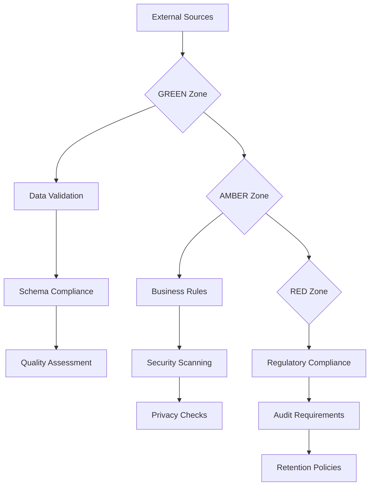
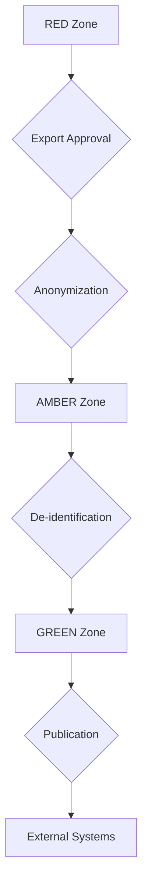

# SMVM Data Zone Architecture

## Overview

This document defines the data zone architecture for the Synthetic Market Validation Module (SMVM). The system implements a three-zone model (RED/AMBER/GREEN) with strict data flow controls to ensure security, compliance, and operational safety.

## Zone Definitions

### RED Zone (Restricted)
**Security Level**: Maximum
**Data Classification**: Highly sensitive, production data
**Access Control**: Need-to-know basis only
**Retention**: 7 years minimum (regulatory requirement)
**Encryption**: AES-256 at rest and in transit

**Contents**:
- Production user data
- Financial transaction records
- Personally identifiable information (PII)
- Regulatory reporting data
- Audit trails and security logs

**Access Requirements**:
- Explicit business justification
- Management approval
- Audit logging of all access
- Time-bound access (maximum 4 hours)
- Multi-factor authentication required

### AMBER Zone (Internal)
**Security Level**: High
**Data Classification**: Internal business data
**Access Control**: Role-based with business justification
**Retention**: 3 years (business requirement)
**Encryption**: AES-256 at rest, TLS 1.3 in transit

**Contents**:
- Market analysis results
- Simulation outputs
- Competitor intelligence
- Business strategy documents
- Internal performance metrics

**Access Requirements**:
- Valid business role (developer, operator, auditor)
- Business justification for access
- Session logging and monitoring
- Regular access reviews

### GREEN Zone (Public/Test)
**Security Level**: Standard
**Data Classification**: Non-sensitive, test data
**Access Control**: Open to authorized users
**Retention**: 90 days (operational requirement)
**Encryption**: TLS 1.3 in transit

**Contents**:
- Test datasets and scenarios
- Development artifacts
- Public documentation
- Training materials
- Non-sensitive logs

**Access Requirements**:
- Valid user account
- Basic authentication
- Session monitoring
- No special approvals required

## Data Flow Architecture

### Zone Transition Rules

#### Inbound Flows (Data Entering Zones)


#### Outbound Flows (Data Leaving Zones)


### Allowed Transitions

| From Zone | To Zone | Conditions | Approval Required | Audit Required |
|-----------|---------|------------|-------------------|----------------|
| **GREEN** | GREEN | Always allowed | No | Session logging |
| **GREEN** | AMBER | Data promotion | Business justification | Access logging |
| **GREEN** | RED | Never allowed | N/A | N/A |
| **AMBER** | GREEN | Data demotion | No | Session logging |
| **AMBER** | AMBER | Always allowed | No | Session logging |
| **AMBER** | RED | Sensitive data | Management approval | Full audit trail |
| **RED** | GREEN | Never allowed | N/A | N/A |
| **RED** | AMBER | De-classification | Security review | Full audit trail |
| **RED** | RED | Always allowed | No | Session logging |

## Zone Implementation

### Physical Architecture
```yaml
# Network segmentation
zones:
  green:
    network: "10.0.0.0/16"
    security_groups: ["sg-green-public"]
    nacl_rules:
      - allow: "0.0.0.0/0"
        ports: ["80", "443"]

  amber:
    network: "10.1.0.0/16"
    security_groups: ["sg-amber-internal"]
    nacl_rules:
      - allow: "10.0.0.0/16"
        ports: ["443", "3306", "6379"]
      - deny: "0.0.0.0/0"
        ports: ["all"]

  red:
    network: "10.2.0.0/16"
    security_groups: ["sg-red-restricted"]
    nacl_rules:
      - allow: "10.1.0.0/16"
        ports: ["443"]
      - deny: "0.0.0.0/0"
        ports: ["all"]
```

### Service Architecture
```yaml
# Service deployment by zone
services:
  green:
    - name: "smvm-cli"
      access: "public"
    - name: "smvm-docs"
      access: "public"
    - name: "smvm-training"
      access: "internal"

  amber:
    - name: "smvm-ingestion"
      access: "service"
    - name: "smvm-personas"
      access: "service"
    - name: "smvm-competitors"
      access: "service"
    - name: "smvm-simulation"
      access: "service"
    - name: "smvm-analysis"
      access: "service"

  red:
    - name: "smvm-production-db"
      access: "service"
    - name: "smvm-audit-log"
      access: "service"
    - name: "smvm-security-monitor"
      access: "service"
```

### Data Storage Architecture
```yaml
# Data storage by zone
storage:
  green:
    databases:
      - name: "smvm_test_db"
        type: "postgresql"
        retention: "90 days"
    object_store:
      - name: "smvm-test-data"
        type: "s3"
        retention: "90 days"

  amber:
    databases:
      - name: "smvm_analysis_db"
        type: "postgresql"
        retention: "3 years"
    object_store:
      - name: "smvm-analysis-results"
        type: "s3"
        retention: "3 years"

  red:
    databases:
      - name: "smvm_production_db"
        type: "postgresql"
        retention: "7 years"
      - name: "smvm_audit_db"
        type: "postgresql"
        retention: "indefinite"
    object_store:
      - name: "smvm-production-data"
        type: "s3"
        retention: "7 years"
      - name: "smvm-security-logs"
        type: "s3"
        retention: "7 years"
```

## Zone Boundary Enforcement

### Network Controls
```python
def enforce_zone_boundary(source_zone: str, target_zone: str, user: User, resource: str) -> bool:
    """Enforce zone boundary access controls"""

    # Define allowed transitions
    allowed_transitions = {
        ("GREEN", "GREEN"): True,
        ("GREEN", "AMBER"): True,  # Promotion allowed
        ("AMBER", "GREEN"): True,  # Demotion allowed
        ("AMBER", "AMBER"): True,
        ("AMBER", "RED"): check_red_promotion_approval(user, resource),  # Requires approval
        ("RED", "AMBER"): check_red_demotion_approval(user, resource),   # Requires approval
        ("RED", "RED"): True,
    }

    # Check if transition is allowed
    transition_key = (source_zone, target_zone)
    allowed = allowed_transitions.get(transition_key, False)

    if not allowed:
        # Log denied transition
        logger.warning({
            "event_type": "ZONE_TRANSITION_DENIED",
            "source_zone": source_zone,
            "target_zone": target_zone,
            "user_id": user.id,
            "user_roles": user.roles,
            "resource": resource,
            "timestamp": datetime.utcnow().isoformat() + "Z",
            "python_version": "3.12.10"
        })
        return False

    # Log successful transition
    logger.info({
        "event_type": "ZONE_TRANSITION",
        "source_zone": source_zone,
        "target_zone": target_zone,
        "user_id": user.id,
        "user_roles": user.roles,
        "resource": resource,
        "timestamp": datetime.utcnow().isoformat() + "Z",
        "python_version": "3.12.10"
    })

    return True
```

### Application Controls
```python
class ZoneEnforcer:
    def __init__(self):
        self.zone_mappings = {
            "smvm-cli": "GREEN",
            "smvm-ingestion": "AMBER",
            "smvm-personas": "AMBER",
            "smvm-competitors": "AMBER",
            "smvm-simulation": "AMBER",
            "smvm-analysis": "AMBER",
            "smvm-production-db": "RED",
            "smvm-audit-log": "RED"
        }

    def get_service_zone(self, service_name: str) -> str:
        """Get zone for service"""
        return self.zone_mappings.get(service_name, "GREEN")

    def can_access(self, source_service: str, target_service: str, user: User) -> bool:
        """Check if source service can access target service"""

        source_zone = self.get_service_zone(source_service)
        target_zone = self.get_service_zone(target_service)

        # Get resource type for target service
        resource_type = self._get_resource_type(target_service)

        return enforce_zone_boundary(source_zone, target_zone, user, resource_type)

    def _get_resource_type(self, service_name: str) -> str:
        """Get resource type for service"""
        resource_mappings = {
            "smvm-production-db": "database",
            "smvm-audit-log": "logs",
            "smvm-analysis": "computation",
            "smvm-simulation": "computation"
        }
        return resource_mappings.get(service_name, "service")
```

## Data Lifecycle Management

### Data Promotion Process
```python
def promote_data_to_amber(green_data_id: str, user: User, justification: str) -> bool:
    """Promote data from GREEN to AMBER zone"""

    # Validate user permissions
    if "operator" not in user.roles and "auditor" not in user.roles:
        logger.error(f"User {user.id} lacks permission to promote data")
        return False

    # Check data quality
    quality_score = assess_data_quality(green_data_id)
    if quality_score < 0.8:
        logger.error(f"Data {green_data_id} quality too low for promotion: {quality_score}")
        return False

    # Create promotion record
    promotion_record = {
        "data_id": green_data_id,
        "from_zone": "GREEN",
        "to_zone": "AMBER",
        "user_id": user.id,
        "justification": justification,
        "quality_score": quality_score,
        "timestamp": datetime.utcnow().isoformat() + "Z",
        "python_version": "3.12.10"
    }

    # Log promotion
    logger.info({
        "event_type": "DATA_PROMOTION",
        **promotion_record
    })

    # Move data physically
    success = move_data_between_zones(green_data_id, "GREEN", "AMBER")

    if success:
        # Update data classification
        update_data_classification(green_data_id, "AMBER")

    return success
```

### Data Demotion Process
```python
def demote_data_from_red(red_data_id: str, user: User, justification: str) -> bool:
    """Demote data from RED to AMBER zone (de-classification)"""

    # Validate user permissions (security team only)
    if "security" not in user.roles:
        logger.error(f"User {user.id} lacks permission to demote RED data")
        return False

    # Check de-classification approval
    approval = get_declassification_approval(red_data_id, user)
    if not approval["approved"]:
        logger.error(f"De-classification not approved for {red_data_id}: {approval['reason']}")
        return False

    # Apply data anonymization
    anonymized_data_id = anonymize_red_data(red_data_id)

    # Create demotion record
    demotion_record = {
        "original_data_id": red_data_id,
        "anonymized_data_id": anonymized_data_id,
        "from_zone": "RED",
        "to_zone": "AMBER",
        "user_id": user.id,
        "justification": justification,
        "approval_reference": approval["reference"],
        "timestamp": datetime.utcnow().isoformat() + "Z",
        "python_version": "3.12.10"
    }

    # Log demotion
    logger.info({
        "event_type": "DATA_DEMOTION",
        **demotion_record
    })

    # Move anonymized data
    success = move_data_between_zones(anonymized_data_id, "RED", "AMBER")

    if success:
        # Update data classification
        update_data_classification(anonymized_data_id, "AMBER")

    return success
```

## Monitoring & Compliance

### Zone Health Monitoring
```python
def monitor_zone_health() -> dict:
    """Monitor health of all zones"""

    health = {}

    for zone in ["GREEN", "AMBER", "RED"]:
        zone_health = {
            "services_up": count_services_up(zone),
            "data_integrity": check_data_integrity(zone),
            "access_patterns": analyze_access_patterns(zone),
            "security_events": count_security_events(zone),
            "compliance_status": check_compliance_status(zone)
        }

        health[zone] = zone_health

        # Alert on issues
        if zone_health["services_up"] < 0.95:
            alert_zone_service_degradation(zone, zone_health["services_up"])

        if zone_health["security_events"] > 0:
            alert_zone_security_events(zone, zone_health["security_events"])

    return health
```

### Compliance Reporting
```python
def generate_zone_compliance_report() -> dict:
    """Generate compliance report for all zones"""

    report = {
        "generated_at": datetime.utcnow().isoformat() + "Z",
        "period": "last_30_days",
        "zones": {}
    }

    for zone in ["GREEN", "AMBER", "RED"]:
        zone_report = {
            "data_classification_accuracy": calculate_classification_accuracy(zone),
            "access_control_effectiveness": calculate_access_control_effectiveness(zone),
            "audit_completeness": calculate_audit_completeness(zone),
            "incident_response_time": calculate_incident_response_time(zone),
            "compliance_violations": count_compliance_violations(zone)
        }

        report["zones"][zone] = zone_report

    return report
```

## Emergency Procedures

### Zone Breach Response
1. **Immediate Containment**
   ```bash
   # Isolate breached zone
   kubectl cordon nodes -l zone=breached

   # Disable zone transitions
   ./scripts/disable-zone-transitions.sh breached

   # Enable emergency logging
   ./scripts/enable-emergency-logging.sh
   ```

2. **Investigation**
   ```bash
   # Collect breach evidence
   ./scripts/collect-breach-evidence.sh breached

   # Analyze access patterns
   ./scripts/analyze-access-patterns.sh breached
   ```

3. **Recovery**
   ```bash
   # Restore from clean backup
   ./scripts/restore-from-backup.sh breached

   # Verify zone integrity
   ./scripts/verify-zone-integrity.sh breached

   # Re-enable zone transitions
   ./scripts/enable-zone-transitions.sh breached
   ```

4. **Post-Incident Review**
   ```bash
   # Analyze incident timeline
   ./scripts/incident-analysis.sh --zone-breach

   # Update security controls
   ./scripts/update-zone-controls.sh
   ```

## Integration with SMVM Services

### Service Zone Assignment
```python
# Service zone configuration
SERVICE_ZONES = {
    "ingestion": "AMBER",      # Processes external data
    "personas": "AMBER",       # Internal analysis data
    "competitors": "AMBER",    # Competitive intelligence
    "simulation": "AMBER",     # Simulation results
    "analysis": "AMBER",       # Analysis outputs
    "overwatch": "GREEN",      # Monitoring and control
    "memory": "AMBER",         # Knowledge graph data
    "cli": "GREEN"            # User interface
}
```

### Zone-Aware Service Communication
```python
class ZoneAwareService:
    def __init__(self, service_name: str, zone_enforcer: ZoneEnforcer):
        self.service_name = service_name
        self.zone = SERVICE_ZONES.get(service_name, "GREEN")
        self.zone_enforcer = zone_enforcer

    def call_service(self, target_service: str, operation: str, user: User, data: dict):
        """Call another service with zone boundary checks"""

        # Check zone boundary
        if not self.zone_enforcer.can_access(self.service_name, target_service, user):
            raise PermissionError(f"Access denied: {self.zone} -> {SERVICE_ZONES.get(target_service, 'GREEN')}")

        # Log zone transition
        logger.info({
            "event_type": "SERVICE_CALL",
            "source_service": self.service_name,
            "target_service": target_service,
            "source_zone": self.zone,
            "target_zone": SERVICE_ZONES.get(target_service, "GREEN"),
            "user_id": user.id,
            "operation": operation,
            "timestamp": datetime.utcnow().isoformat() + "Z",
            "python_version": "3.12.10"
        })

        # Execute service call
        return self._execute_service_call(target_service, operation, data)
```

---

**Version**: 1.0
**Effective Date**: 2024-12-XX
**Review Date**: 2025-06-XX
**Last Updated**: 2024-12-XX
**Owner**: Security Team
**Reviewers**: DevOps Team, Compliance Officer

*This zone architecture ensures secure, compliant data flows across the SMVM system.*
