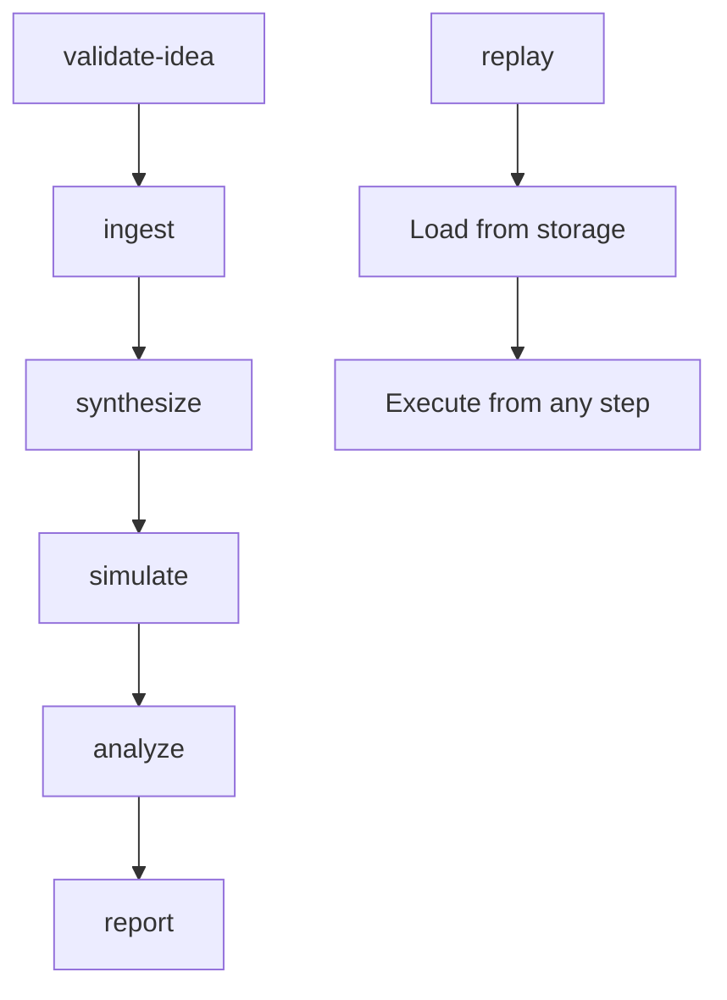

# SMVM CLI Command Specifications

## Overview

The SMVM CLI provides a comprehensive command-line interface for executing the Synthetic Market Validation Module end-to-end pipeline. Each command supports standardized flags for run identification, configuration, and resource management.

## Global Flags

All commands support the following global flags:

| Flag | Type | Description | Required | Default |
|------|------|-------------|----------|---------|
| `--run-id` | `string` | Unique run identifier (auto-generated if not provided) | No | Auto-generated UUID |
| `--seed` | `integer` | Random seed for reproducible results | No | Random |
| `--config` | `string` | Path to configuration file (YAML) | No | `configs/dev.yaml` |
| `--max-tokens-per-step` | `integer` | Maximum tokens per pipeline step | No | 3000 |
| `--dry-run` | `boolean` | Execute without making external calls | No | `false` |
| `--verbose` | `boolean` | Enable verbose logging | No | `false` |
| `--log-level` | `string` | Logging level (DEBUG/INFO/WARN/ERROR) | No | `INFO` |

## Command Specifications

### 1. `validate-idea`

**Purpose**: Validate a business idea against SMVM contracts and generate initial assessment.

**Usage**:
```bash
smvm validate-idea <idea_file> [flags]
```

**Arguments**:
- `idea_file`: Path to JSON file containing business idea (must conform to `idea.input.json` schema)

**Flags**:
- All global flags supported
- `--output-dir`: Directory for output files (default: auto-generated run directory)
- `--skip-validation`: Skip schema validation (for testing only)

**Outputs**:
- `validation_result.json`: Initial validation results
- `events.jsonl`: Audit trail events
- `meta.json`: Run metadata

**Token Budget**: 500 tokens

**Timeout**: 60 seconds

**Example**:
```bash
smvm validate-idea business_idea.json --run-id test-run-001 --config configs/dev.yaml
```

**Success Criteria**:
- Schema validation passes
- Basic feasibility assessment completes
- Audit trail properly generated

### 2. `ingest`

**Purpose**: Ingest public/sanitized market signals from various sources.

**Usage**:
```bash
smvm ingest [sources...] [flags]
```

**Arguments**:
- `sources`: List of data sources to ingest (trends, forums, competitor_pages, directories)

**Flags**:
- All global flags supported
- `--sources-config`: Path to sources configuration file
- `--batch-size`: Number of items to process per batch (default: 100)
- `--rate-limit`: API rate limit (requests per minute, default: 60)
- `--retry-attempts`: Number of retry attempts (default: 3)
- `--retry-delay`: Delay between retries in seconds (default: 5)

**Outputs**:
- `runs/{run_id}/inputs/trends_normalized.json`
- `runs/{run_id}/inputs/forums_normalized.json`
- `runs/{run_id}/inputs/competitor_normalized.json`
- `runs/{run_id}/inputs/directory_normalized.json`
- `events.jsonl`: Ingestion audit trail
- `meta.json`: Ingestion metadata

**Token Budget**: 2000 tokens

**Timeout**: 300 seconds

**Example**:
```bash
smvm ingest trends forums --run-id ingestion-run-001 --batch-size 50 --rate-limit 30
```

**Success Criteria**:
- All specified sources successfully ingested
- Data normalization completes without errors
- Rate limits respected
- Retry logic handles transient failures

### 3. `synthesize`

**Purpose**: Synthesize ICP personas and competitor profiles from ingested data.

**Usage**:
```bash
smvm synthesize [flags]
```

**Arguments**: None

**Flags**:
- All global flags supported
- `--input-dir`: Directory containing normalized input data
- `--persona-count`: Number of personas to generate (default: 5)
- `--competitor-count`: Number of competitors to analyze (default: 10)
- `--bias-controls`: Path to bias control configuration
- `--confidence-threshold`: Minimum confidence score (default: 0.7)

**Outputs**:
- `runs/{run_id}/outputs/personas.output.json`
- `runs/{run_id}/outputs/competitors.output.json`
- `events.jsonl`: Synthesis audit trail
- `meta.json`: Synthesis metadata

**Token Budget**: 3000 tokens

**Timeout**: 600 seconds

**Example**:
```bash
smvm synthesize --run-id synthesis-run-001 --persona-count 5 --competitor-count 8
```

**Success Criteria**:
- Persona and competitor outputs match schemas
- Bias controls applied correctly
- Confidence scores meet threshold
- Diversity requirements satisfied

### 4. `simulate`

**Purpose**: Run agent-based market simulations with generated personas and competitors.

**Usage**:
```bash
smvm simulate [flags]
```

**Arguments**: None

**Flags**:
- All global flags supported
- `--simulation-config`: Path to simulation configuration file
- `--iterations`: Number of simulation iterations (default: 1000)
- `--scenario`: Simulation scenario (price_cut, feature_launch, downturn, hype_cycle, seasonality)
- `--parallel-jobs`: Number of parallel simulation jobs (default: 4)
- `--memory-limit`: Memory limit per job in MB (default: 512)

**Outputs**:
- `runs/{run_id}/outputs/simulation.result.json`
- `runs/{run_id}/outputs/simulation_metrics.json`
- `events.jsonl`: Simulation audit trail
- `meta.json`: Simulation metadata

**Token Budget**: 5000 tokens

**Timeout**: 1800 seconds (30 minutes)

**Example**:
```bash
smvm simulate --run-id simulation-run-001 --iterations 500 --scenario price_cut --parallel-jobs 2
```

**Success Criteria**:
- Simulation completes all iterations
- Results match simulation.result.json schema
- Determinism test passes (same seed = same results)
- Performance within memory and time limits

### 5. `analyze`

**Purpose**: Analyze simulation results and generate WTP estimates with decision recommendations.

**Usage**:
```bash
smvm analyze [flags]
```

**Arguments**: None

**Flags**:
- All global flags supported
- `--simulation-results`: Path to simulation results file
- `--analysis-config`: Path to analysis configuration
- `--confidence-intervals`: Calculate confidence intervals (default: true)
- `--sensitivity-analysis`: Perform sensitivity analysis (default: true)
- `--report-format`: Output format (json, markdown, both) (default: both)

**Outputs**:
- `runs/{run_id}/outputs/decision.output.json`
- `runs/{run_id}/reports/validation_report.md` (if markdown format)
- `events.jsonl`: Analysis audit trail
- `meta.json`: Analysis metadata

**Token Budget**: 4000 tokens

**Timeout**: 900 seconds (15 minutes)

**Example**:
```bash
smvm analyze --run-id analysis-run-001 --simulation-results runs/sim-run-001/outputs/simulation.result.json
```

**Success Criteria**:
- Decision output matches schema
- WTP estimation within accuracy bounds
- Confidence intervals calculated
- Audit trail complete

### 6. `report`

**Purpose**: Generate comprehensive validation report from analysis results.

**Usage**:
```bash
smvm report [flags]
```

**Arguments**: None

**Flags**:
- All global flags supported
- `--decision-data`: Path to decision output file
- `--template`: Report template to use (default: validation_report.md)
- `--include-evidence`: Include evidence sections (default: true)
- `--redact-sensitive`: Redact sensitive information (default: true)
- `--output-format`: Report format (markdown, pdf, html) (default: markdown)

**Outputs**:
- `runs/{run_id}/reports/validation_report.md`
- `runs/{run_id}/reports/validation_report.pdf` (if pdf format)
- `events.jsonl`: Report generation audit trail
- `meta.json`: Report metadata

**Token Budget**: 2000 tokens

**Timeout**: 300 seconds

**Example**:
```bash
smvm report --run-id report-run-001 --decision-data runs/analysis-run-001/outputs/decision.output.json
```

**Success Criteria**:
- Report template properly filled
- All required sections included
- Sensitive data properly redacted
- File generation completes without errors

### 7. `replay`

**Purpose**: Replay a previous SMVM run from stored artifacts.

**Usage**:
```bash
smvm replay <run_id> [flags]
```

**Arguments**:
- `run_id`: Run ID to replay

**Flags**:
- All global flags supported
- `--from-step`: Step to start replay from (default: beginning)
- `--to-step`: Step to end replay at (default: end)
- `--force-regeneration`: Force regeneration of all outputs (default: false)
- `--compare-results`: Compare new results with stored results (default: true)

**Outputs**:
- `runs/{new_run_id}/`: Complete run directory with all outputs
- `runs/{new_run_id}/replay_comparison.json` (if compare enabled)
- `events.jsonl`: Replay audit trail
- `meta.json`: Replay metadata

**Token Budget**: 1000 tokens

**Timeout**: 600 seconds

**Example**:
```bash
smvm replay original-run-001 --from-step synthesize --to-step analyze
```

**Success Criteria**:
- Original run data successfully loaded
- Replay generates identical results (when using same seed)
- Comparison report accurate (if enabled)
- No data corruption or loss

## Command Dependencies



## Error Handling

All commands implement consistent error handling:

- **Exit Codes**:
  - `0`: Success
  - `1`: General error
  - `2`: Configuration error
  - `3`: Validation error
  - `4`: Resource limit exceeded
  - `5`: External service error

- **Error Messages**: Structured JSON error output with error codes, messages, and recovery suggestions

- **Recovery Mechanisms**:
  - Automatic retry with exponential backoff
  - Circuit breaker pattern for external services
  - Graceful degradation for non-critical failures
  - Idempotency keys for safe retries

## Security and Access Control

### RBAC Integration
- Commands require appropriate role permissions
- Sensitive operations log access attempts
- Configuration files support environment-specific credentials

### Data Protection
- All outputs stored in GREEN zone
- PII automatically redacted
- Encryption at rest for sensitive data
- Audit trails maintained for all operations

## Performance and Resource Management

### Token Management
- Per-step token budgets enforced
- Automatic caching of expensive operations
- Token usage tracking and reporting
- Circuit breaker for token limit violations

### Resource Optimization
- Parallel execution for independent steps
- Memory-efficient data structures
- Cleanup of temporary files
- Connection pooling for external services

## Monitoring and Observability

### Logging
- Structured JSON logging for all operations
- Performance metrics collection
- Error tracking with context
- Audit trail generation

### Metrics
- Command execution times
- Token usage per step
- Success/failure rates
- Resource utilization

## Configuration

### Environment Variables
- `SMVM_CONFIG_PATH`: Default configuration directory
- `SMVM_LOG_LEVEL`: Default logging level
- `SMVM_CACHE_DIR`: Cache directory location
- `SMVM_MAX_TOKENS`: Global token limit

### Configuration Files
- Support for YAML configuration files
- Environment-specific overrides
- Dynamic configuration reloading
- Validation of configuration schemas

## Integration Points

### TractionBuild Integration
- Automatic status updates via webhooks
- Project synchronization
- Gate management for T0+3 validation
- Result persistence to TractionBuild storage

### External Services
- Rate-limited API calls
- Retry logic with jitter
- Circuit breaker patterns
- Connection pooling

## Testing and Validation

### Dry Run Mode
- Execute without external calls
- Validate configuration and permissions
- Generate mock outputs for testing
- Performance profiling

### Validation Checks
- Schema validation for all inputs/outputs
- Business rule validation
- Data quality checks
- Consistency validation

## Usage Examples

### Complete E2E Pipeline
```bash
# Validate idea
smvm validate-idea idea.json --run-id e2e-run-001

# Ingest market data
smvm ingest trends forums competitor_pages --run-id e2e-run-001

# Generate personas and competitors
smvm synthesize --run-id e2e-run-001

# Run market simulation
smvm simulate --run-id e2e-run-001 --iterations 1000

# Analyze results and make decision
smvm analyze --run-id e2e-run-001

# Generate final report
smvm report --run-id e2e-run-001
```

### Selective Replay
```bash
# Replay only simulation step with new parameters
smvm replay original-run-001 --from-step simulate --iterations 2000 --scenario downturn
```

### Batch Processing
```bash
# Process multiple ideas in batch
for idea in ideas/*.json; do
    run_id="batch-$(basename $idea .json)"
    smvm validate-idea "$idea" --run-id "$run_id" --dry-run
done
```

## Command Implementation Notes

### Idempotency
- All commands support idempotency via run_id
- Safe retry without duplicate processing
- State tracking for partial executions
- Cleanup mechanisms for failed runs

### State Management
- Run state persisted to disk
- Recovery from interrupted executions
- Progress tracking and reporting
- Automatic cleanup of stale state

### Extensibility
- Plugin architecture for custom commands
- Configuration-driven behavior
- Hook points for custom integrations
- Modular design for easy maintenance

## Troubleshooting

### Common Issues
- **Token Limit Exceeded**: Reduce batch sizes or increase token budget
- **Rate Limit Hit**: Implement retry with backoff or reduce frequency
- **Schema Validation Failed**: Check input data format and update schemas
- **Memory Limit Exceeded**: Reduce parallel jobs or increase memory allocation

### Debug Mode
- `--verbose` flag enables detailed logging
- `--dry-run` validates without execution
- Debug logs include performance metrics
- Error logs include stack traces and context

## Future Enhancements

### Planned Features
- Interactive mode for step-by-step execution
- Web UI for pipeline monitoring
- Advanced retry strategies with ML-based backoff
- Real-time progress dashboards
- Automated optimization suggestions

### API Integration
- REST API for programmatic access
- Webhook support for external integrations
- Streaming results for long-running operations
- Batch processing APIs

---

## Document Information

- **Version**: 1.0.0
- **Last Updated**: December 2, 2024
- **Review Cycle**: Monthly
- **Owner**: SMVM Engineering Team
- **Approval**: Technical Review Board

## Appendices

### Appendix A: Command Schemas
Detailed JSON schemas for command inputs and outputs.

### Appendix B: Error Code Reference
Complete list of error codes and recovery procedures.

### Appendix C: Performance Benchmarks
Expected performance characteristics and resource requirements.
